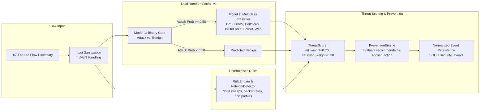
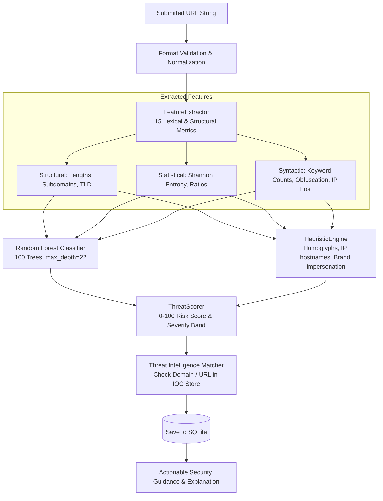
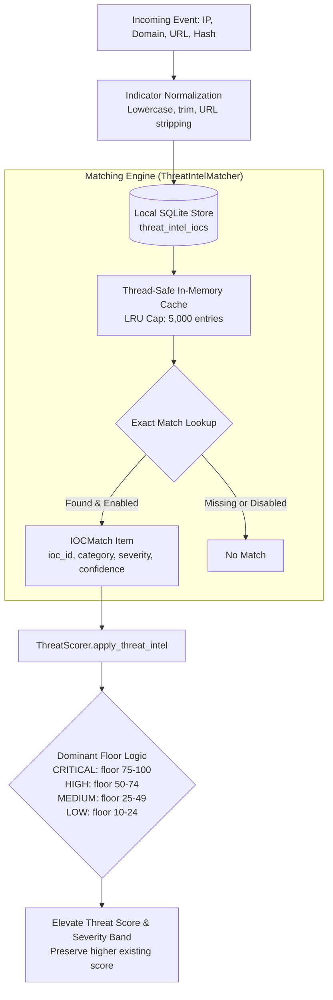
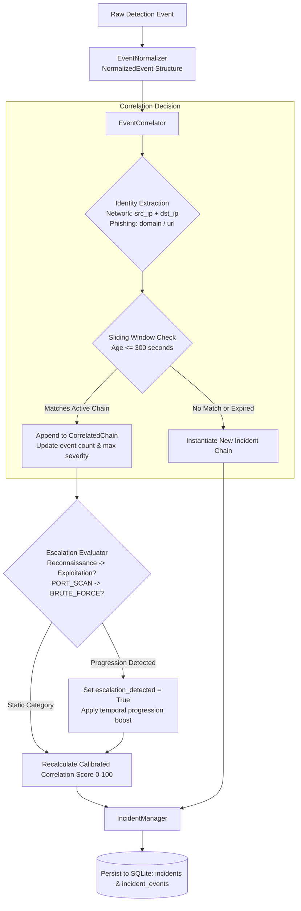
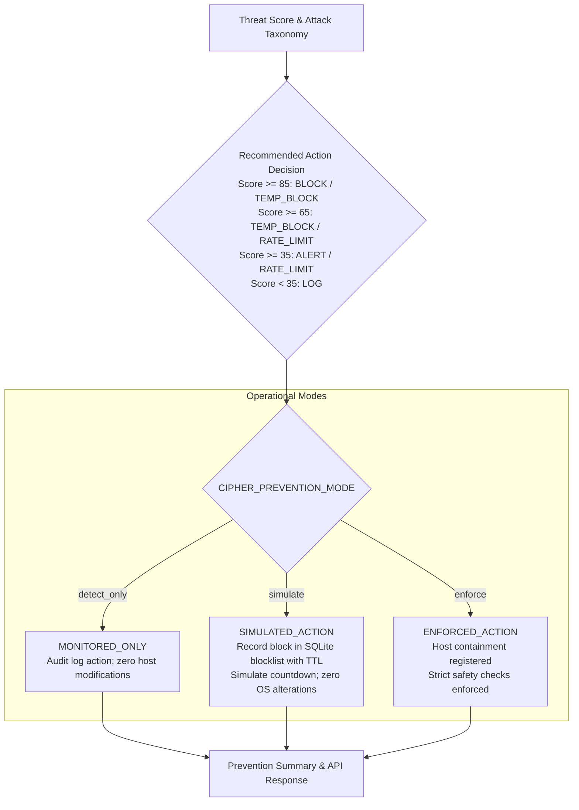

# CIPHER — System Architecture & Component Interactions

**CIPHER** (*Cyber Intrusion Prevention & Heuristic Event Response*) is a local-first, dual-subsystem, defense-in-depth cybersecurity platform. It combines machine learning detection, deterministic heuristic/signature engines, local threat intelligence, stateful multi-stage event correlation, calibrated threat scoring, automated intrusion prevention, and a modern Security Operations Center (SOC) dashboard.

---

## 1. High-Level CIPHER Architecture

The overarching system flow unifies incoming network traffic and web indicators through multi-layered inspection, scoring, correlation, and response:

```mermaid
flowchart TD
    subgraph Ingestion["1. Ingestion & Collection Layer"]
        A1[Network Packet Capture / Npcap] --> B1[Live Network Sensor]
        A2[REST API Flow Requests] --> B2[Network Service]
        A3[Suspicious URL Submissions] --> B3[Phishing Service]
    end

    subgraph FeaturePipeline["2. Feature & State Processing"]
        B1 --> C1[Flow Aggregator / 67 Flow Features]
        C1 --> B2
        B3 --> C2[URL Feature Extractor / 15 Lexical Features]
    end

    subgraph DetectionLayer["3. Unified Detection Layer"]
        B2 --> D1[Network ML: Dual Random Forest<br/>Binary Gate + Multiclass Classifier]
        B2 --> D2[Network Heuristics & Signatures<br/>10 Heuristics + 4 Signatures]
        C2 --> D3[Phishing ML: Random Forest Classifier]
        C2 --> D4[Phishing Heuristic Engine<br/>Lexical & Homoglyph Rules]
    end

    subgraph IntelligenceAndScoring["4. Intelligence & Risk Synthesis"]
        D1 & D2 & D3 & D4 --> E1[Threat Intelligence Store & Matcher<br/>Local SQLite IOCs: IP, Domain, URL, Hash]
        E1 --> E2[Calibrated ThreatScorer 0-100<br/>Weighted Synergy + Dominant IOC Floor]
    end

    subgraph CorrelationAndResponse["5. Correlation, Response & Persistence"]
        E2 --> F1[Unified Correlation Service<br/>Sliding Window 300s + Strict Identity Matching]
        F1 --> F2[Incident Manager<br/>Lifecycle Tracking & Multi-Stage Escalation]
        F1 --> F3[Intrusion Prevention Engine<br/>detect_only | simulate | enforce]
        F1 & F2 & F3 --> G1[(SQLite Unified Database<br/>Events, Incidents, IOCs, Blocklist)]
    end

    subgraph Presentation["6. Presentation & Management Layer"]
        G1 --> H1[FastAPI REST API Gateway<br/>Port 8000 / Same-Origin Reverse Proxy]
        H1 --> H2[SOC Operations Dashboard<br/>React 18 + TypeScript + Vite / Port 5173]
    end
```

---

## 2. Network IDS Pipeline

The Network IDS combines local ML inference with deterministic heuristic rules to evaluate bidirectional flow records derived from the CIC-IDS2017 schema:



---

## 3. Live Sensor Pipeline

The live sensor captures raw packets via Npcap, aggregates them into bidirectional flows, extracts 67 statistical metrics, and automatically feeds them into detection:

```mermaid
flowchart TD
    subgraph Capture["Packet Ingestion"]
        P[Physical / Loopback Interface] -->|Scapy / Npcap Async Sniffer| S[LiveNetworkSensor]
        S -->|BPF Filter & Packet Callback| Q[Raw IP/TCP/UDP Packets]
    end

    subgraph Aggregation["Flow Tracking Engine"]
        Q --> K{Flow Key Extraction<br/>src_ip, dst_ip, src_port, dst_port, proto}
        K -->|Lookup or Create| T[Bidirectional Flow Table<br/>Bounded Cap: 50,000 active flows]
        T -->|Update packet counters, payload lengths, IATs, flags| M[In-Memory Flow State]
    end

    subgraph Expiration["Flow Eviction & Dispatch"]
        M --> E{Timeout Evaluator<br/>Idle: 5s | Active: 60s}
        E -->|Expired / FIN / RST| F[Finalize Flow & Compute 67 Features]
        F --> D[Dispatch to NetworkService.analyze_flow]
        D --> R[Correlation & Response Pipeline]
    end
```

---

## 4. Phishing Detection Pipeline

The phishing subsystem inspects URLs using 15 lexical and structural features without relying on external web lookups or page fetching:



---

## 5. Threat Intelligence Pipeline

The local-first IOC subsystem matches observed network and domain indicators against an indexed SQLite store without leaking queries to third parties:



---

## 6. Multi-Stage Event Correlation Pipeline

The correlation layer groups temporally and causally related security events into unified incident chains while strictly preventing improper cross-destination merging:



---

## 7. Intrusion Prevention Pipeline

The prevention engine determines defensive actions according to calculated threat scores and operational mode with strict Windows host safety:



---

## 8. Frontend & REST API Architecture

The Phase 9 SOC Dashboard interacts with the backend through a modular client layer backed by Vite's development proxy:

```mermaid
flowchart TD
    subgraph Browser["SOC Dashboard (frontend)"]
        UI[React 18 SPA Components<br/>Overview, Live Events, Incidents, Network IDS,<br/>Phishing, Threat Intel, Rules, Prevention, Sensor, Health]
        UI --> STATE[React State Hooks & Polling Handlers]
        STATE --> CLIENT[Centralized API Client: src/api/client.ts]
    end

    subgraph DevProxy["Reverse Proxy Layer"]
        CLIENT -->|HTTP /api/...| PROXY[Vite Dev Server Proxy<br/>Target: http://127.0.0.1:8000]
    end

    subgraph BackendGateway["FastAPI Gateway (backend)"]
        PROXY --> ROUTER[FastAPI Application<br/>main.py / Port 8000]
        ROUTER --> R1[/api/health & /api/system/status]
        ROUTER --> R2[/api/events & /api/stats]
        ROUTER --> R3[/api/incidents & /api/correlation/stats]
        ROUTER --> R4[/api/network/* & /api/phishing/analyze]
        ROUTER --> R5[/api/rules/* & /api/threat-intel/*]
    end

    BackendGateway --> SQLITE[(cipher.db)]
```
